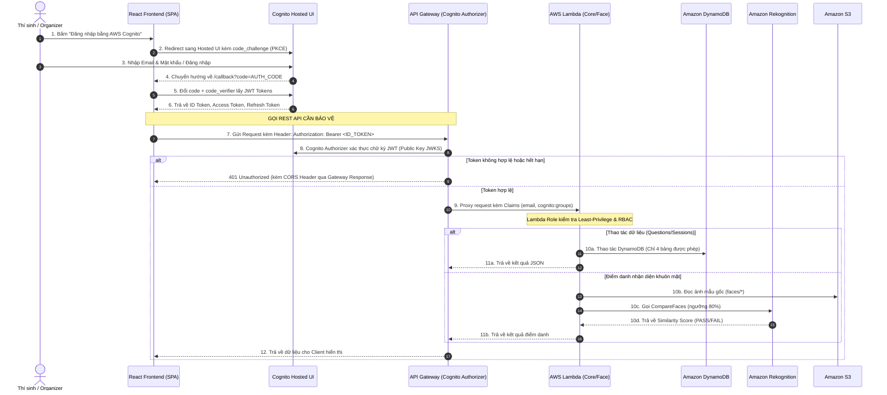

# HƯỚNG DẪN CHI TIẾT VỀ AMAZON COGNITO, API GATEWAY AUTHORIZER & IAM LEAST-PRIVILEGE SECURITY

**Dự án:** CloudExam - Nền tảng tổ chức & vận hành kỳ thi trực tuyến trên AWS  
**Thành viên phụ trách:** Mạnh  
**Phạm vi trách nhiệm:** 
1. Amazon Cognito User Pool & Hosted UI
2. Cấu hình Callback URL, Logout URL & PKCE Flow
3. API Gateway Cognito Authorizer & Gateway Responses CORS
4. Thiết kế IAM Role & Policy tối thiểu cho Lambda (Principle of Least Privilege)
5. Phân quyền tài nguyên (Resource-based & Identity-based Policies)

---

## 1. Kiến trúc Tổng quan & Luồng Xác thực (Security Architecture)

### 1.1. Sơ đồ tuần tự (Authentication & Authorization Flow)

Hệ thống CloudExam áp dụng chuẩn xác thực hiện đại nhất cho Single-Page Application (SPA): **OAuth 2.0 Authorization Code Grant kết hợp PKCE (Proof Key for Code Exchange)**.



---

## 2. Chi tiết Thiết kế & Cấu hình Amazon Cognito

### 2.1. Cognito User Pool (`cloudexam-user-pool-dev`)
- **Đăng nhập bằng Email:** Người dùng đăng nhập bằng địa chỉ email duy nhất, hệ thống tự động gửi email chứa mã xác thực 6 số khi đăng ký (`CONFIRM_WITH_CODE`).
- **Chính sách mật khẩu (Password Policy):**
  - Tối thiểu 8 ký tự.
  - Yêu cầu đủ: Chữ hoa, chữ thường, chữ số và ký tự đặc biệt (`!@#$%^&*`).
  - Mật khẩu tạm thời có hiệu lực trong 7 ngày.
- **Account Recovery:** Khôi phục tài khoản thông qua verified email.
- **Schema Attributes:**
  - `email` (Required, Mutable): Định danh người dùng.
  - `name` (Optional, Mutable): Họ và tên đầy đủ.
  - `custom:student_code` (Optional, Mutable): Mã số sinh viên (ví dụ: `B21DCCN001`).

### 2.2. Phân quyền Người dùng qua Nhóm (Cognito Groups - RBAC)
Hệ thống định nghĩa 3 nhóm quyền với thứ tự ưu tiên (`precedence`):
1. **`Admin` (Precedence 1):** Toàn quyền cấu hình hệ thống, quản lý kỳ thi, người dùng và giám sát.
2. **`Organizer` (Precedence 2):** Giảng viên / Người tổ chức thi. Có quyền tạo câu hỏi, import danh sách thí sinh, tải ảnh mẫu khuôn mặt và tạo ca thi.
3. **`Candidate` (Precedence 3):** Thí sinh dự thi. Chỉ có quyền xem thông tin ca thi được chỉ định, thực hiện xác thực khuôn mặt, làm bài và nộp bài.

### 2.3. Cấu hình Hosted UI (Branding & Domain)
- **Domain Prefix:** `cloudexam-auth-645123576198-dev` (hoặc prefix tùy chỉnh qua biến `cognito_domain_prefix`).
- **Địa chỉ Hosted UI đầy đủ:**  
  `https://cloudexam-auth-645123576198-dev.auth.ap-southeast-1.amazoncognito.com`
- Đảm bảo giao diện đăng nhập / đăng ký chuẩn AWS, không cần tự code form đăng nhập, hỗ trợ bảo mật chống tấn công brute-force.

### 2.4. Cấu hình App Client (Single Page Application - SPA)
- **Loại Client:** Public Client (SPA chạy trên React Vite phía Client) $\rightarrow$ `generate_secret = false` (Không tạo Client Secret vì Client không thể giấu mã bí mật).
- **OAuth Grant Flow:** `code` (Authorization Code Grant).
- **Bảo mật PKCE:** Bắt buộc sử dụng mã băm `code_challenge` (S256) khi gọi `/oauth2/authorize` và `code_verifier` khi gọi `/oauth2/token`.
- **Allowed OAuth Scopes:** `openid`, `email`, `profile`.
- **Allowed Callback URLs:**
  - `http://localhost:5173/callback` (Dev local)
  - `http://localhost:3000/callback` (Dự phòng)
  - `https://<branch>.<appid>.amplifyapp.com/callback` (Production triển khai trên AWS Amplify)
- **Allowed Sign-out / Logout URLs:**
  - `http://localhost:5173/`
  - `http://localhost:3000/`
  - `https://<branch>.<appid>.amplifyapp.com/`
- **Thời hạn Token:**
  - `id_token`: 1 giờ (Chứa thông tin profile, email, nhóm quyền).
  - `access_token`: 1 giờ (Dùng để cấp quyền gọi API).
  - `refresh_token`: 30 ngày (Dùng làm mới token mà không bắt người dùng đăng nhập lại).

### 2.5. Cognito Identity Pool (Federated Identities)
- Mục đích: Cung cấp Temporary AWS Credentials (`AWS_ACCESS_KEY_ID`, `AWS_SECRET_ACCESS_KEY`, `AWS_SESSION_TOKEN`) cho Frontend để người dùng tải ảnh trực tiếp lên Amazon S3 (`questions/*` và `faces/*`).
- Role cho Authenticated Users được gắn Policy tối thiểu (xem chi tiết ở Mục 4).

---

## 3. Thiết kế API Gateway & Cognito Authorizer

### 3.1. REST API Endpoints
API Gateway bảo vệ toàn bộ các REST endpoints phía sau thông qua **Cognito User Pool Authorizer**:

| Method | Resource Path | Authorizer | Mục đích nghiệp vụ | Quyền yêu cầu (RBAC) |
| :--- | :--- | :--- | :--- | :--- |
| `OPTIONS` | `/*` | None (Mock 200) | Preflight request giải quyết CORS | Public |
| `GET` | `/questions` | Cognito Authorizer | Lấy danh sách câu hỏi | Admin, Organizer, Candidate |
| `POST` | `/questions` | Cognito Authorizer | Tạo câu hỏi mới | Admin, Organizer |
| `GET` | `/questions/{id}` | Cognito Authorizer | Xem chi tiết 1 câu hỏi | Admin, Organizer |
| `PUT` | `/questions/{id}` | Cognito Authorizer | Cập nhật câu hỏi | Admin, Organizer |
| `DELETE`| `/questions/{id}` | Cognito Authorizer | Xóa câu hỏi | Admin, Organizer |
| `GET` | `/candidates` | Cognito Authorizer | Lấy danh sách thí sinh | Admin, Organizer |
| `POST` | `/candidates` | Cognito Authorizer | Import / Thêm thí sinh | Admin, Organizer |
| `GET` | `/candidates/{email}` | Cognito Authorizer | Xem chi tiết thí sinh | Admin, Organizer |
| `DELETE`| `/candidates/{email}` | Cognito Authorizer | Xóa thí sinh | Admin, Organizer |
| `GET` | `/sessions` | Cognito Authorizer | Lấy danh sách ca thi | Admin, Organizer, Candidate |
| `POST` | `/sessions` | Cognito Authorizer | Tạo ca thi mới & sinh link | Admin, Organizer |
| `GET` | `/sessions/{id}` | Cognito Authorizer | Xem chi tiết ca thi | Admin, Organizer, Candidate |
| `PUT` | `/sessions/{id}` | Cognito Authorizer | Cập nhật trạng thái ca thi | Admin, Organizer |
| `POST` | `/auth/face-verify` | Cognito Authorizer | Điểm danh khuôn mặt thí sinh | Candidate, Organizer |
| `POST` | `/exam/submit` | Cognito Authorizer | Nộp bài thi trắc nghiệm | Candidate |

### 3.2. Cấu hình Cognito Authorizer
- **Type:** `COGNITO_USER_POOLS`
- **Provider ARN:** `arn:aws:cognito-idp:ap-southeast-1:...:userpool/...`
- **Token Header:** `Authorization`
- Cơ chế hoạt động: Khi request gửi lên có header `Authorization: Bearer <id_token>`, API Gateway tự động xác thực chữ ký mật mã (RSA Signature) với public key từ endpoint JWKS của Cognito (`https://cognito-idp.<region>.amazonaws.com/<userPoolId>/.well-known/jwks.json`). Nếu hợp lệ, các trường trong token (Claims) sẽ được giải mã và chuyển tiếp vào Lambda context (`event.requestContext.authorizer.claims`).

### 3.3. Xử lý CORS & Gateway Responses (Điểm mấu chốt)
Một lỗi rất phổ biến khi làm API Gateway với Cognito là: khi Token hết hạn hoặc sai, API Gateway trả về `401 Unauthorized`. Nếu không cấu hình **Gateway Responses**, API Gateway sẽ trả về 401 mà **không có CORS Headers**, dẫn đến trình duyệt báo lỗi `CORS error` thay vì hiển thị mã 401.

Hệ thống đã giải quyết triệt để vấn đề này trong Terraform bằng cách cấu hình:
1. `DEFAULT_4XX`: Tự động đính kèm `Access-Control-Allow-Origin: '*'` vào tất cả phản hồi 400, 401, 403, 404.
2. `DEFAULT_5XX`: Tự động đính kèm CORS headers vào phản hồi lỗi server 500, 502, 503.
3. `OPTIONS MOCK Integration`: Trả về HTTP 200 cho tất cả preflight requests với method `OPTIONS`.

---

## 4. Thiết kế IAM Role & Policy Tối thiểu (Principle of Least Privilege)

Nguyên tắc **Đặc quyền tối thiểu (Least Privilege)** là tiêu chuẩn an toàn quan trọng nhất của AWS: *Một tài nguyên (Lambda, User) chỉ được cấp đúng những quyền cần thiết trên đúng những tài nguyên định danh cụ thể, không thừa một quyền nào.*

### 4.1. Ma trận Phân quyền IAM (Permission Matrix)

| IAM Role | Mục đích | Các Action được cấp | Tài nguyên bị giới hạn (Resource ARN) |
| :--- | :--- | :--- | :--- |
| **`CloudExam-Lambda-CoreAPI-Role`** | Thực thi Core API (CRUD câu hỏi, ca thi, thí sinh, nộp bài) | `logs:CreateLogGroup`, `logs:CreateLogStream`, `logs:PutLogEvents`<br>`dynamodb:GetItem`, `dynamodb:PutItem`, `dynamodb:UpdateItem`, `dynamodb:DeleteItem`, `dynamodb:Query`, `dynamodb:Scan`, `dynamodb:BatchWriteItem`<br>`s3:GetObject`, `s3:PutObject`, `s3:DeleteObject` | `arn:aws:logs:...:log-group:/aws/lambda/cloudexam-*`<br>Chỉ 4 bảng DynamoDB của dự án và các GSI (`CloudExam_Questions_*`, `CloudExam_Candidates_*`, `CloudExam_Sessions_*`, `CloudExam_QuestionBanks_*`)<br>Chỉ prefix `questions/*` và `faces/*` trên S3 Bucket |
| **`CloudExam-Lambda-FaceVerify-Role`** | Điểm danh thí sinh bằng Amazon Rekognition | `logs:CreateLogGroup`, `logs:CreateLogStream`, `logs:PutLogEvents`<br>`dynamodb:GetItem`, `dynamodb:Query` (CHỈ ĐỌC)<br>`s3:GetObject` (CHỈ ĐỌC)<br>`rekognition:CompareFaces` | `arn:aws:logs:...:log-group:/aws/lambda/cloudexam-face-verify-*`<br>Chỉ bảng `Candidates` và `Sessions`<br>Chỉ thư mục `faces/*` trên S3<br>`*` (API stateless của Rekognition) |
| **`CloudExam-Cognito-Auth-Role`** | Cấp cho người dùng Frontend upload ảnh | `s3:PutObject`<br>`s3:GetObject` | Chỉ thư mục `questions/*` và `faces/*`<br>S3 Bucket |

### 4.2. Những điểm an toàn tuyệt đối trong thiết kế Policy của Mạnh
1. **Không sử dụng Managed Policy `AdministratorAccess` hoặc `PowerUserAccess`:** Tất cả các role đều dùng Inline / Customer Managed Policy được thu hẹp hành vi.
2. **Không cấp quyền DDL (Data Definition Language) trên DynamoDB:** Lambda tuyệt đối không có quyền `dynamodb:DeleteTable`, `dynamodb:UpdateTable`, tránh rủi ro xóa nhầm cơ sở dữ liệu khi có lỗ hổng code.
3. **Phân tách quyền giữa Core API và Face Verification:** Lambda Face Verification chỉ có quyền **Read-Only** trên DynamoDB và S3, không có quyền chỉnh sửa câu hỏi hay ca thi. Action với Rekognition chỉ cấp đúng `rekognition:CompareFaces`, không cấp quyền tạo hay xoá Face Collection (`rekognition:DeleteCollection`).

---

## 5. Hướng dẫn Triển khai & Vận hành

### Cách 1: Triển khai tự động bằng Terraform (Khuyến nghị 100%)

#### Bước 1: Di chuyển vào thư mục Terraform
```bash
cd backend/terraform
```

#### Bước 2: Khởi tạo và kiểm tra cấu hình
```bash
terraform init
terraform validate
```

#### Bước 3: Xem kế hoạch tạo tài nguyên (Plan)
```bash
terraform plan
```

#### Bước 4: Triển khai lên AWS (Apply)
```bash
terraform apply -auto-approve
```

Sau khi hoàn tất, Terraform sẽ in ra toàn bộ giá trị outputs cần thiết:
- `cognito_user_pool_id`
- `cognito_app_client_id`
- `cognito_domain`
- `cognito_identity_pool_id`
- `api_gateway_base_url`

#### Bước 5: Cập nhật biến môi trường cho Frontend
Mở file `frontend/.env.local` và dán các giá trị outputs từ Terraform vào:
```env
VITE_USE_MOCK=false
VITE_AWS_REGION=ap-southeast-1
VITE_COGNITO_DOMAIN=https://cloudexam-auth-645123576198-dev.auth.ap-southeast-1.amazoncognito.com
VITE_COGNITO_CLIENT_ID=<Giá trị cognito_app_client_id từ Terraform>
VITE_COGNITO_REDIRECT_URI=http://localhost:5173/callback
VITE_COGNITO_USER_POOL_ID=<Giá trị cognito_user_pool_id từ Terraform>
VITE_IDENTITY_POOL_ID=<Giá trị cognito_identity_pool_id từ Terraform>
VITE_API_BASE_URL=<Giá trị api_gateway_base_url từ Terraform>
VITE_S3_BUCKET_NAME=cloudexam-storage-409289618109-dev
```

Khởi động Frontend để kiểm tra:
```bash
cd ../../frontend
npm run dev
```

---

### Cách 2: Hướng dẫn Cấu hình Thủ công trên AWS Web Console (Phòng khi Thầy cô yêu cầu thực hành tại chỗ)

#### A. Cấu hình Cognito User Pool
1. Mở AWS Console $\rightarrow$ Tìm dịch vụ **Cognito** $\rightarrow$ Bấm **Create user pool**.
2. **Step 1 (Configure sign-in experience):**
   - Chọn **Cognito user pool**.
   - Tích chọn **Email**.
3. **Step 2 (Configure security requirements):**
   - Mật khẩu: Chọn **Cognito defaults** (tối thiểu 8 ký tự, có số, chữ hoa, chữ thường, ký tự đặc biệt).
   - MFA: Chọn **No MFA** (phù hợp môi trường học tập dev).
4. **Step 3 (Configure sign-up experience):**
   - Tích chọn **Enable self-registration**.
   - Attributes: Tích chọn `email` (Required), thêm `name`.
5. **Step 4 (Configure message delivery):**
   - Chọn **Send email with Cognito** (Trial/Default).
6. **Step 5 (Integrate your app):**
   - User pool name: `cloudexam-user-pool-dev`.
   - Hosted authentication pages: Tích chọn **Use the Cognito Hosted UI**.
   - Domain: Chọn **Use a Cognito domain**, nhập prefix `cloudexam-auth-dev-uet`.
   - App client:
     - App client name: `cloudexam-web-client-dev`.
     - Client secret: Chọn **Don't generate a client secret** (quan trọng cho SPA).
     - Callback URLs: Thêm `http://localhost:5173/callback`.
     - Sign-out URLs: Thêm `http://localhost:5173/`.
     - OAuth 2.0 grant types: Chọn **Authorization code grant**.
     - OpenID Connect scopes: Tích chọn `OpenID`, `Email`, `Profile`.
7. **Bấm Create user pool**.
8. **Tạo Groups:** Vào tab **Groups** $\rightarrow$ Bấm **Create group** $\rightarrow$ Tạo lần lượt `Admin`, `Organizer`, `Candidate`.
9. **Tạo User thử nghiệm:** Vào tab **Users** $\rightarrow$ Bấm **Create user** $\rightarrow$ Nhập email, đặt mật khẩu $\rightarrow$ Vào chi tiết user, bấm **Add user to group** $\rightarrow$ Chọn `Organizer`.

#### B. Cấu hình API Gateway Cognito Authorizer
1. Mở dịch vụ **API Gateway** $\rightarrow$ Chọn API `cloudexam-api-dev` (hoặc Create REST API).
2. Ở thanh bên trái, chọn mục **Authorizers** $\rightarrow$ Bấm **Create authorizer**.
3. Cấu hình:
   - **Name:** `CognitoUserPoolAuthorizer`
   - **Authorizer type:** `Cognito`
   - **Cognito user pool:** Chọn User Pool vừa tạo ở bước trên.
   - **Token source:** Nhập `Authorization`
   - **Token validation:** Để trống (mặc định kiểm tra JWT).
4. Bấm **Create authorizer**.
5. Bấm nút **Test**, dán ID Token lấy từ frontend vào để kiểm tra trạng thái 200 OK.
6. **Gắn vào Method:** Vào mục **Resources** $\rightarrow$ Chọn các method như `GET /questions`, `POST /questions` $\rightarrow$ Bấm vào **Method Request** $\rightarrow$ Tại mục **Authorization**, bấm sửa và chọn `CognitoUserPoolAuthorizer` $\rightarrow$ Lưu lại.
7. **Deploy API:** Bấm nút **Deploy API** ở góc trên bên phải $\rightarrow$ Chọn Stage `dev` $\rightarrow$ Deploy.

---

## 6. Bộ Câu hỏi & Câu trả lời Mẫu Xuất sắc khi Bảo vệ Đồ án trước Giảng viên

### Câu 1: Em hãy giải thích vai trò của Amazon Cognito trong kiến trúc của hệ thống CloudExam?
> **Mạnh trả lời:**  
> *"Dạ thưa thầy/cô, Amazon Cognito đóng vai trò là dịch vụ Identity Provider (IdP) quản lý danh tính và kiểm soát truy cập cho hệ thống CloudExam theo mô hình PaaS Serverless. Cụ thể em sử dụng 2 thành phần chính:  
> 1. **Cognito User Pool:** Quản lý vòng đời tài khoản thí sinh và giảng viên (đăng ký, xác thực qua email, quản lý phiên đăng nhập và phân quyền nhóm Admin / Organizer / Candidate qua Claims).  
> 2. **Cognito Hosted UI:** Cung cấp trang đăng nhập chuẩn bảo mật OAuth 2.0 với luồng Authorization Code kết hợp PKCE, giúp bảo vệ frontend SPA mà không để lộ mật khẩu hay client secret.  
> 3. **Cognito Identity Pool:** Cung cấp temporary credentials để frontend có thể upload ảnh bài thi và ảnh khuôn mặt trực tiếp lên Amazon S3 một cách an toàn."*

---

### Câu 2: Tại sao với Frontend React (SPA) em lại chọn Authorization Code + PKCE thay vì Implicit Flow hay lưu trực tiếp Secret Key?
> **Mạnh trả lời:**  
> *"Dạ thưa thầy/cô, vì React chạy hoàn toàn trên trình duyệt người dùng (Public Client), nên nếu dùng Client Secret thì mã bí mật sẽ bị lộ 100% trong mã nguồn JS.  
> Chuẩn OAuth trước đây từng cho phép Implicit Grant trả token trực tiếp trên URL hash, nhưng hiện nay RFC 8252 đã khuyến nghị không dùng vì rủi ro lộ token qua lịch sử duyệt web hoặc Access Log.  
> Em chọn **Authorization Code kết hợp PKCE (Proof Key for Code Exchange)**: Frontend tự sinh ngẫu nhiên một chuỗi `code_verifier` và băm SHA-256 thành `code_challenge`. Kẻ tấn công nếu có đánh cắp được `authorization_code` trên đường truyền cũng không thể đổi lấy token được vì thiếu chuỗi bí mật `code_verifier` ban đầu."*

---

### Câu 3: API Gateway xác thực Token như thế nào? Tại sao frontend gửi `id_token` mà không phải `access_token`?
> **Mạnh trả lời:**  
> *"Dạ thưa thầy/cô, API Gateway sử dụng **Cognito User Pool Authorizer**. Khi frontend gửi request kèm header `Authorization: Bearer <token>`, API Gateway tự động tải tập khóa công khai (JWKS) từ Cognito để giải mã và kiểm tra chữ ký điện tử RSA của token mà không cần phải gọi lại Cognito trong mỗi request, giúp độ trễ cực thấp.  
> Nhóm em lựa chọn gửi `id_token` vì `id_token` chứa đầy đủ các thông tin danh tính (Claims) bao gồm: email thí sinh, họ tên, và danh sách nhóm quyền `cognito:groups`. Nhờ đó, Lambda có thể bóc tách claims để thực hiện phân quyền chi tiết (RBAC) như Organizer mới được tạo ca thi, còn Candidate chỉ được làm bài."*

---

### Câu 4: Em hiểu thế nào về Nguyên tắc Đặc quyền tối thiểu (Least Privilege) và em đã áp dụng nó trong dự án này ra sao?
> **Mạnh trả lời:**  
> *"Dạ thưa thầy/cô, Principle of Least Privilege là nguyên tắc chỉ cấp đúng những quyền tối thiểu cần thiết để một dịch vụ hoàn thành nhiệm vụ, trên đúng tài nguyên được chỉ định. Em áp dụng cụ thể như sau:  
> 1. **Tuyệt đối không dùng Admin Access:** Không cấp wildcard `*` trên Action hay Resource trừ trường hợp bất khả kháng của AWS (như API stateless `rekognition:CompareFaces`).  
> 2. **Bó hẹp theo Resource ARN:** Role của Core API Lambda chỉ được phép thao tác trên đúng 4 bảng DynamoDB của dự án và prefix `questions/*`, `faces/*` của S3 bucket dự án.  
> 3. **Chặn quyền phá hoại:** Lambda chỉ có quyền thao tác dữ liệu (GetItem, PutItem, UpdateItem), bị tước hoàn toàn quyền DDL như `DeleteTable`.  
> 4. **Tách biệt Role theo nghiệp vụ:** Lambda Face Verification chỉ có quyền **Read-Only** trên DynamoDB và S3, cộng thêm duy nhất 1 action `rekognition:CompareFaces` để so khớp ảnh, không có quyền can thiệp vào ngân hàng câu hỏi."*

---

### Câu 5: Nếu Token của người dùng hết hạn thì điều gì sẽ xảy ra? Tại sao cần cấu hình Gateway Responses trên API Gateway?
> **Mạnh trả lời:**  
> *"Dạ thưa thầy/cô, khi token hết hạn, Cognito Authorizer sẽ từ chối request ngay tại cửa ngõ API Gateway và trả về mã lỗi HTTP 401 Unauthorized trước khi request chạm tới Lambda, giúp tiết kiệm chi phí chạy Lambda.  
> Tuy nhiên, mặc định API Gateway khi trả về 401 sẽ không kèm các header CORS (`Access-Control-Allow-Origin`). Trình duyệt thấy thiếu header CORS sẽ lập tức chặn và báo lỗi mạng CORS error thay vì 401, khiến frontend không biết là token đã hết hạn để chuyển hướng đăng nhập lại.  
> Em đã cấu hình **Gateway Responses** cho `DEFAULT_4XX` và `DEFAULT_5XX` trên API Gateway để luôn luôn đính kèm header CORS trong mọi trường hợp lỗi, đảm bảo trải nghiệm người dùng mượt mà và chuẩn kiến trúc Cloud."*
